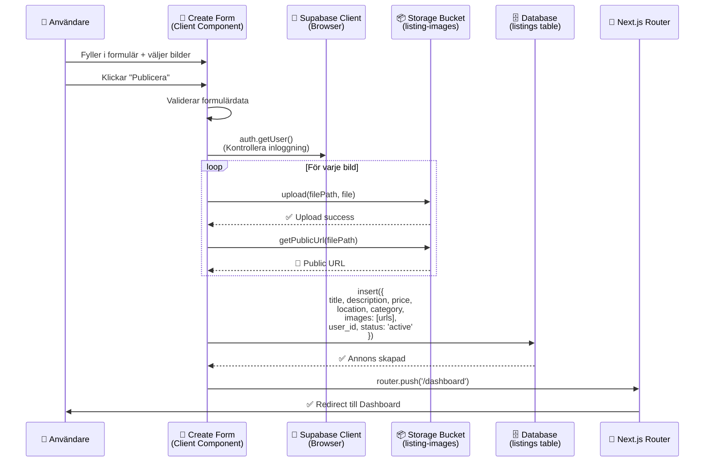
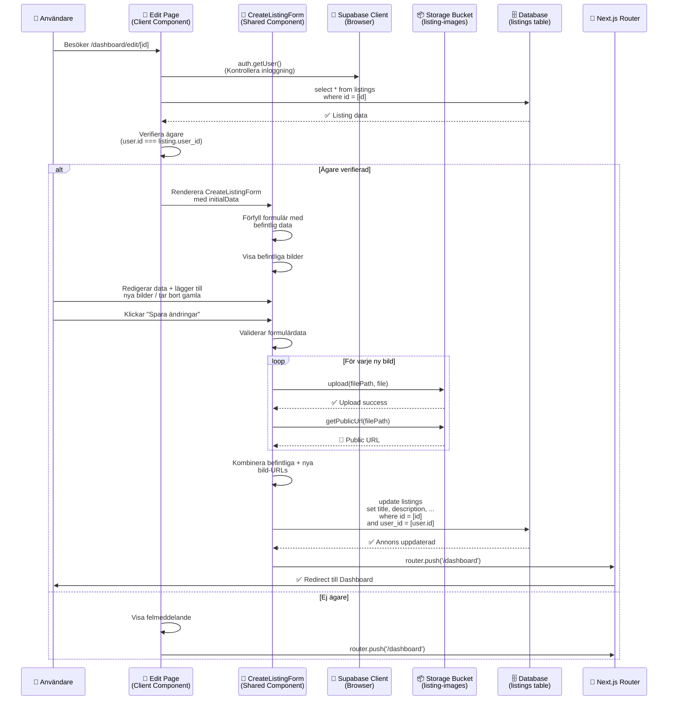
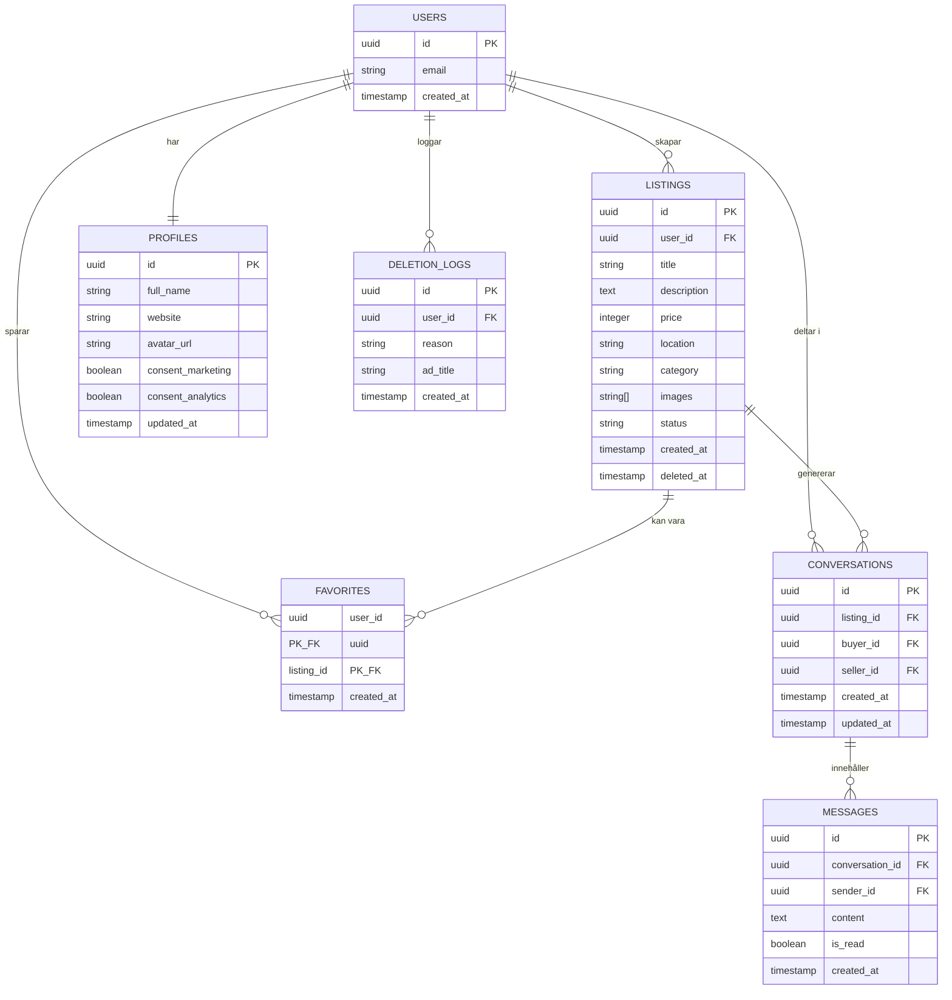
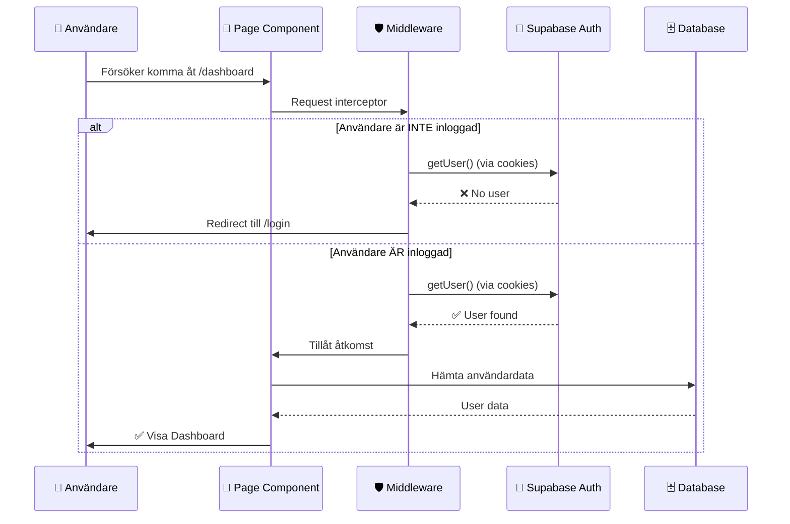

# 🏗️ Systemarkitektur - Kollahär Marketplace

Detta dokument beskriver systemets övergripande arkitektur, dataflöden och entitetsrelationer. Detta är dokumentationen för **Arkitekter & AI-assistenter**.

## 📊 Systemöversikt

Kollahär är en **fullstack Next.js-applikation** med Supabase som Backend-as-a-Service (BaaS). Applikationen följer Next.js App Router-mönstret med en tydlig separation mellan Client och Server Components.

### Arkitekturprinciper

1. **Server Components First**: Datahämtning sker på servern där det är möjligt
2. **Client Components för Interaktivitet**: Endast när interaktivitet krävs (forms, buttons, state)
3. **Service Layer**: Abstraktioner för API-anrop (`listingService.ts`, `messageService.ts`)
4. **Type Safety**: TypeScript genom hela stacken
5. **Security First**: Row Level Security (RLS) på alla tabeller

## 🔄 Dataflöde: Skapa Annons

Följande diagram visar hur data flödar när en användare skapar en annons:



### Steg-för-steg Förklaring

1. **Användaren fyller i formuläret** (`app/dashboard/create/page.tsx`)
   - Formuläret är en Client Component eftersom den behöver hantera state (bildförhandsvisning, validering)

2. **Bilduppladdning**
   - Varje bild laddas upp till Supabase Storage (`listing-images` bucket)
   - Filnamn genereras: `${user.id}/${timestamp}-${random}.${ext}`
   - Public URL hämtas och sparas i en array

3. **Databasinsert**
   - Alla formulärdata + bild-URLs insertas i `listings`-tabellen
   - `user_id` kopplas automatiskt från session
   - `status` sätts till `'active'`

4. **Redirect**
   - Efter lyckad insert redirectas användaren till Dashboard
   - `router.refresh()` säkerställer att nya data hämtas

## 🔄 Dataflöde: Redigera Annons

Följande diagram visar hur data flödar när en användare redigerar en annons:



### Steg-för-steg Förklaring

1. **Hämta annonsdata** (`app/dashboard/edit/[id]/page.tsx`)
   - Hämtar annons baserat på `params.id`
   - Verifierar att användaren är inloggad
   - **Säkerhetskontroll**: Verifierar att `listing.user_id === user.id`

2. **Förfylld formulär**
   - `CreateListingForm`-komponenten accepterar `initialData` prop
   - Formuläret förfylls med befintlig data via `useEffect`
   - Befintliga bilder visas och kan tas bort

3. **Bildhantering i edit-läge**
   - **Befintliga bilder**: Visas från `existingImageUrls` (kan tas bort)
   - **Nya bilder**: Laddas upp som vanligt (preview innan sparning)
   - **Kombinering**: Vid sparning kombineras `[...existingImageUrls, ...uploadedImageUrls]`

4. **Databasupdate**
   - Uppdaterar endast ändrade fält (title, description, price, location, category, images)
   - **Dubbel säkerhetskontroll**: Verifierar `user_id` både i query och i komponenten
   - Bevarar `created_at` och `user_id` (ändras inte)

5. **Redirect**
   - Efter lyckad update redirectas användaren till Dashboard
   - `router.refresh()` säkerställer att uppdaterade data hämtas

## 🗄️ Entity-Relation Diagram

Följande diagram visar hur entiteterna hänger ihop:



### Viktiga Relationer

- **User → Listings**: En användare kan skapa många annonser (1:N)
- **User → Favorites**: En användare kan spara många favoriter (1:N)
- **Listing → Favorites**: En annons kan vara favorit för många användare (M:N via junction table)
- **Listing → Conversations**: En annons kan generera många konversationer (1:N)
- **Conversation → Messages**: En konversation innehåller många meddelanden (1:N)

## 🏛️ Komponenthierarki

```
app/
├── page.tsx (HomePage)
│   ├── Navigation (Header)
│   ├── Hero Section (med integrerat sök & filter)
│   └── ListingCard[] (Grid)
│
├── dashboard/page.tsx (Dashboard)
│   ├── Header (User info, Messages, Settings, Logout)
│   ├── CTA Card (Create new listing)
│   ├── Tabs (Active | Favorites | History)
│   └── Content Area (Tab-specific content)
│
├── dashboard/create/page.tsx (Create Listing)
│   └── CreateListingForm (Återanvändbar form-komponent)
│       └── Form (Title, Category, Price, Location, Description, Images)
│
├── dashboard/edit/[id]/page.tsx (Edit Listing)
│   ├── Fetch Listing (Verifierar ägare)
│   └── CreateListingForm (Med initialData prop)
│       └── Form (Pre-filled med befintlig data)
│
├── components/CreateListingForm.tsx (Shared Component)
│   ├── Accepterar optional initialData prop
│   ├── Hanterar både create och edit mode
│   └── Bildhantering (befintliga + nya bilder)
│
└── annons/[id]/page.tsx (Listing Details)
    ├── Image Gallery
    ├── Listing Info
    ├── Seller Card
    └── Contact Button
```

## 🔐 Autentiseringsflöde



## 📦 Storage Arkitektur

### Buckets

1. **`listing-images`** (Public)
   - Struktur: `{user_id}/{timestamp}-{random}.{ext}`
   - Max 5 bilder per annons
   - Max 2MB per bild
   - Automatisk komprimering via `lib/image-utils.ts`

2. **`avatars`** (Public)
   - Struktur: `{random}.{ext}`
   - Används för profilbilder i Settings

### Bildhantering

```typescript
// Exempel från create/page.tsx
const uploadedImageUrls = await Promise.all(
  imageFiles.map(async (file) => {
    const fileExt = file.name.split('.').pop()
    const fileName = `${Date.now()}-${Math.random().toString(36).slice(2)}.${fileExt}`
    const filePath = `${user.id}/${fileName}`

    await supabase.storage
      .from('listing-images')
      .upload(filePath, file)

    const { data } = supabase.storage
      .from('listing-images')
      .getPublicUrl(filePath)

    return data.publicUrl
  })
)
```

## 🔄 State Management

Kollahär använder **React State** (useState, useEffect) för lokal state-hantering. Ingen global state management (Redux, Zustand) används eftersom:

1. Supabase hanterar server state
2. Next.js App Router hanterar routing state
3. Lokal state räcker för formulär och UI-interaktioner

### State Patterns

- **Client Components**: useState för interaktivitet
- **Server Components**: Data hämtas direkt i komponenten
- **Optimistic Updates**: Används i FavoriteButton för snabb UX

## 🚦 Routing & Navigation

### Routes

```
/                    → HomePage (Public)
/login               → LoginPage (Public, redirects if logged in)
/dashboard           → Dashboard (Protected)
/dashboard/create    → Create Listing (Protected)
/dashboard/edit/[id] → Edit Listing (Protected)
/dashboard/favorites → Favorites Page (Protected)
/dashboard/messages  → Messages Page (Protected)
/dashboard/settings  → Settings Page (Protected)
/annons/[id]         → Listing Details (Public)
```

### Middleware Protection

`middleware.ts` skyddar:
- `/dashboard/*` routes
- Redirectar till `/login` om inte autentiserad
- Redirectar från `/login` till `/dashboard` om redan inloggad

## 🔍 Sök & Filter

### Implementering

Sök och filter sker **client-side** på startsidan:

```typescript
// Från app/page.tsx
useEffect(() => {
  let result = ads

  if (searchQuery) {
    const lowerQuery = searchQuery.toLowerCase()
    result = result.filter(ad => 
      ad.title.toLowerCase().includes(lowerQuery) || 
      ad.description.toLowerCase().includes(lowerQuery)
    )
  }

  if (selectedCategory !== 'Alla') {
    result = result.filter(ad => ad.category === selectedCategory)
  }

  setFilteredAds(result)
}, [searchQuery, selectedCategory, ads])
```

### Framtida Förbättringar

- Server-side search med Supabase Full-Text Search
- Filter på pris, plats, datum
- Sortering (pris, datum, relevans)

## 📱 Responsive Design

Alla komponenter är **mobile-first**:

- **Mobile**: 1 kolumn, stackade element
- **Tablet**: 2 kolumner (grid)
- **Desktop**: 3-4 kolumner (grid)

Breakpoints används via Tailwind:
- `sm:` 640px
- `md:` 768px
- `lg:` 1024px

## 🎯 Prestanda

### Optimeringar

1. **Next.js Image**: Optimerad bildhantering med `next/image`
2. **Server Components**: Datahämtning på servern
3. **Code Splitting**: Automatisk via Next.js App Router
4. **Lazy Loading**: Bilder laddas när de syns

### Mätpunkter

- First Contentful Paint (FCP): < 1.5s
- Largest Contentful Paint (LCP): < 2.5s
- Time to Interactive (TTI): < 3.5s

---

**Nästa steg**: Läs [Backend & Databas](./02-BACKEND_DATABASE.md) för detaljerad information om databasstrukturen och Server Actions.
